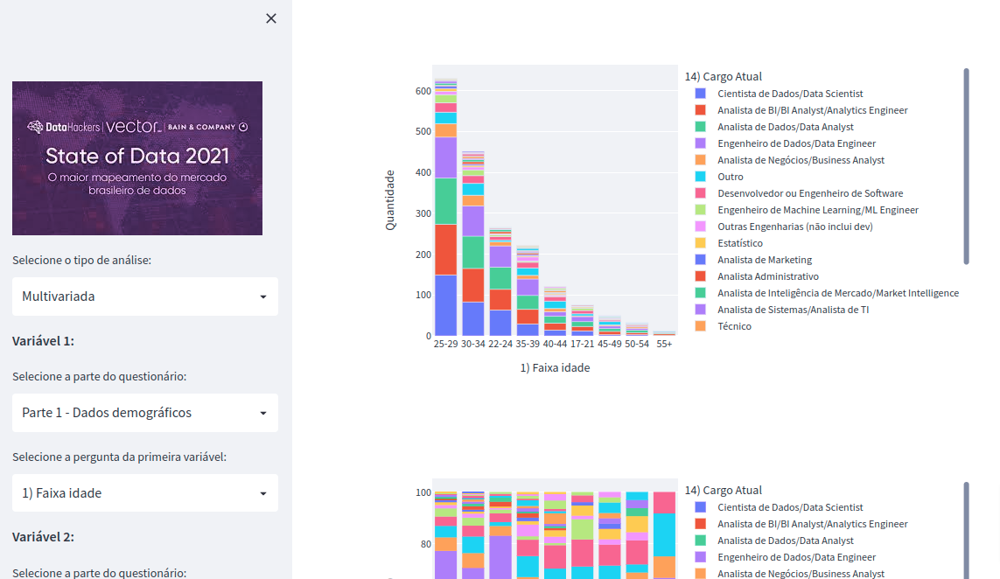

# Desafio Data Hackers / State of Brazil 2021
Repositório para o código-fonte do dashboard do desafio datahackers

Acesso o dashboard [aqui](https://datahackerschallenge.herokuapp.com/)



## Instalação:

1. Crie o ambiente virtual

```
$ python -m venv datahackers_env
```

2. Ative o ambiente virtual:

```
$ . datahackers_env/bin/activate
```

Para desativar:

```
$ deactivate
```

4. Instale as dependências:

```
$ pip install -r requirements.txt
```

Para atualizar as dependências (caso queira adicionar um pacote):

```
pip install --upgrade --force-reinstall -r requirements.txt
```

## Execução

Na pasta raiz do projeto, execute o seguinte comando:

```
$ streamlit run ./app/dash.py
```


## Dados

O notebook responsável pela geração dos dados está disponível no [kaggle]().